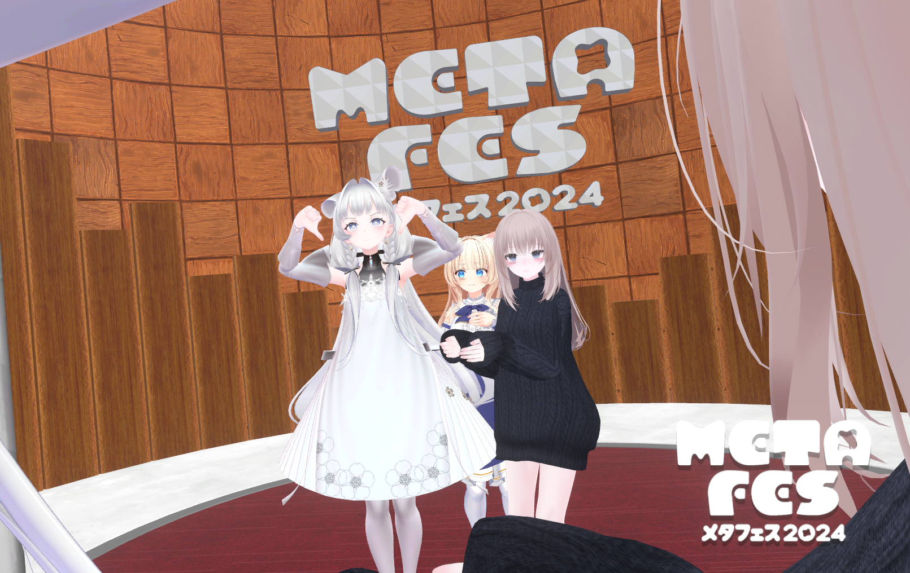
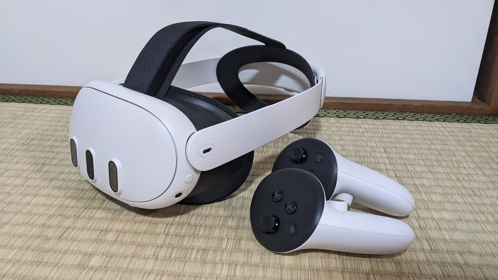
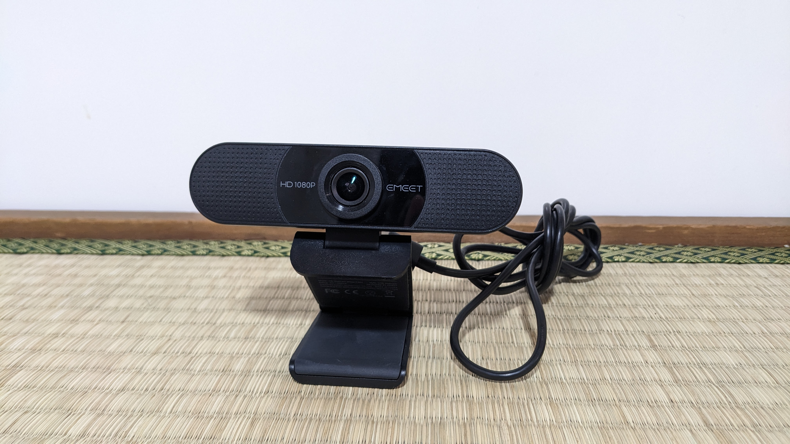
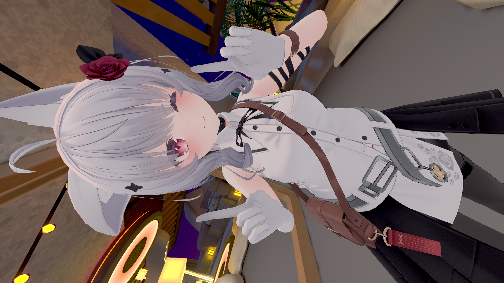
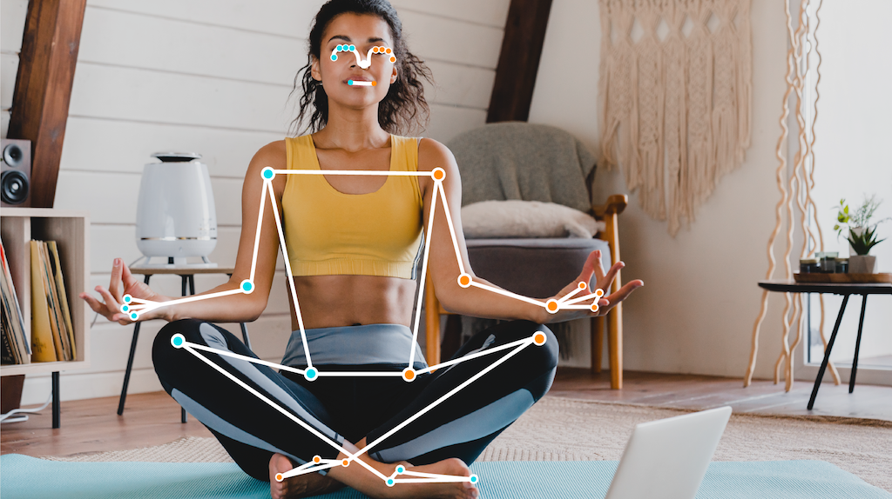
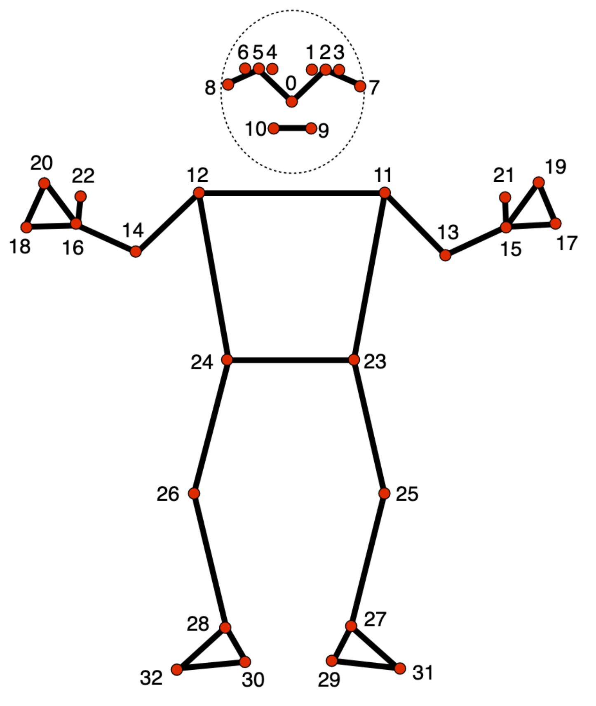

# VRChat用のフルトラをMediaPipeでHello World

## 概要

VRChatとはVR空間上で3Dアバターを使って他の人達と交流することが出来るアプリです。



このVRChatでは様々なトラッキング機材を使用して現実世界の体の動きをVR空間上の自分の3Dアバターに反映することが出来ます。最低限の環境だとVRヘッドセットと左右のコントローラの位置関係で腕と頭の動きを再現できる **3点トラッキング** と呼ばれるものやMeta Quest3を使用しているのであればVRヘッドセットのカメラの測定によるハンドトラッキングや **Vive Trackerやmocopi** 追加のハードウェアにによる腕、胸、腰、足等の装着による **6～11点トラッキング** による所謂 **フルボディートラッキング (FBT)** により3Dアバターの動きを表現力のあるものに出来ます。

ただ、このVive Trackerやmocopiは機材として数万の投資が必要でありこれを安い費用で何とか出来ないかと考え色々と調べていたところWEBカメラを使用してカメラに写った骨格情報をVRChatに反映するというアプリやOSSをいくつか見つけました。

- [Device4VR](https://www.driver4vr.com/)
  - PC, Android, iOSに対応したカメラによるボディートラッキングツール
  - 一部機能は有料
- [Mediapipe-VR-Fullbody-Tracking](https://github.com/ju1ce/Mediapipe-VR-Fullbody-Tracking)
  - MediaPipeと呼ばれるGoogleが開発したニューラルネットワークによる姿勢推定を使用したボディートラッキングツール
  - 無料

これらを見て折角なら自分で自作してみたくなったので、この記事ではカメラによるボディートラッキングツールの開発でどのような実装が必要なのかを解説したいと思います。ただし **最低限の実装** にはなってくるので **WEBカメラを使用したVRChatでのボディーフルトラッキングのHello World** として読み進めていただければ幸いです。

### 使用する機材

#### VRヘッドセット

[Meta Quest 3](https://www.meta.com/jp/quest/quest-3/?srsltid=AfmBOorMWRR-k0CTNcDzh6NGu5OTd-ml-eu-vAGXKTBVvfCcM5oD1qWt)



言わずと知れたFacebookやInstagramの開発で有名なMeta社が販売するVRヘッドセット

#### WEBカメラ

Amazonで2000円程度で売られている格安のWEBカメラ



姿勢推定ができれば良いだけの画質があれば良いので高品質なものは不要となります。

### 使用するアバター

今回の技術検証で使用するアバターは [septem47](https://septem47.booth.pm/) さんが販売されているこちらのアバターを購入し使用させていただきました。

[【オリジナル3Dモデル】シアン - Cian #Cian3D](https://septem47.booth.pm/items/5482062) PC番 (VRM同梱)



## 使用するライブラリや仕様等

今回、WEBカメラによるフルボディートラッキングの実装にあたり次のライブラリや仕様を使用しました。

### MediaPipe

[MediaPipe ソリューション ガイド  |  Google AI Edge  |  Google AI for Developers](https://ai.google.dev/edge/mediapipe/solutions/guide?hl=ja)

MediaPipeとはGoogleが開発しているアプリケーションに人工知能 (AI) と機械学習 (ML) 用のライブラリとツール群になります。オブジェクト検知、画像分類、ジェスチャー認識、手、顔、姿勢等のランドマーク検出等の画像に関するものやテキスト分類、言語検出等のテキストに関するもの、音声に関するもの、画像生成やLLM推論等の生成AIに関するもの等、様々な機能を有するライブラリ、ツール群となっています。

[姿勢ランドマーク検出ガイド  |  Google AI Edge  |  Google AI for Developers](https://ai.google.dev/edge/mediapipe/solutions/vision/pose_landmarker?hl=ja)



画像参照：[姿勢ランドマーク検出ガイド  |  Google AI Edge  |  Google AI for Developers](https://ai.google.dev/edge/mediapipe/solutions/vision/pose_landmarker?hl=ja)

今回のWEBカメラによるフルボディートラッキングの実装に必要となる機能は、その中の姿勢ランドマーク検出機能が必要になるのでそちらを利用します。こちら、静止画や動画の画像からニューラルネットワークの推定により **33個所の身体のランドマーク** を割り出す事が出来る機能になります。



画像参照：[姿勢ランドマーク検出ガイド  |  Google AI Edge  |  Google AI for Developers](https://ai.google.dev/edge/mediapipe/solutions/vision/pose_landmarker?hl=ja)

### VRChatとOSC (Open Sound Control)

OSC (Open Sound Control) とは電子楽器やコンピュータなどの機器においてそのデータをネットワーク経由でリアルタイムに送受信するためのプロトコルです。しかしその汎用性から、しばしばサウンド関係以外のアプリケーションでも使用される事があるらしいです。

[VRChat - OSC Overview](https://docs.vrchat.com/docs/osc-overview)

VRChatでは上記のような仕様が公開されており、ここにはアバターパラメータ、デバッグ、コントローラーの入力、トラッキング、アイトラッキング等の仕様が定義されており、これに従ってMediaPipeから取得したデータを加工しOSCを用いてデータを転送することでボディーフルトラッキングが実装出来るのではないかと考えました。

[VRChat - OSC Trackers](https://docs.vrchat.com/docs/osc-trackers)

ここに定義されている仕様を読む限りではOSC経由でのVRChatのフルボディートラッキングは8点トラッキングになります。

仕様を要約すると下記のようになります。

#### OSCアドレス

```
/tracking/trackers/1/position
/tracking/trackers/1/rotation
/tracking/trackers/2/position
/tracking/trackers/2/rotation
/tracking/trackers/3/position
/tracking/trackers/3/rotation
/tracking/trackers/4/position
/tracking/trackers/4/rotation
/tracking/trackers/5/position
/tracking/trackers/5/rotation
/tracking/trackers/6/position
/tracking/trackers/6/rotation
/tracking/trackers/7/position
/tracking/trackers/7/rotation
/tracking/trackers/8/position
/tracking/trackers/8/rotation
/tracking/trackers/head/position
/tracking/trackers/head/rotation
```

これらのアドレスに対し3つのX, Y, Zの順番でfloat値を入力します。

positionがトラッカーのワールド座標系での位置でrotationがトラッカーのワールド座標系での回転角 (オイラー角) となり各ボーンのローカルの位置や回転角でないので注意が必要です。サポートされている部位としては腰、胸、足✕2、股✕2、肘✕2となります。

1から8の番号のどの番号がどの部位になるのかは決まっておらずVRChatでキャリブレーションされた際にOSCにより入力された座標とVRChatのアバターのトラッカーに追従する部位が自動的に対応付けられるので、どの番号にどの部位を割り当てるかはアプリケーションの任意で大丈夫です。

headに関してはVRChat内での位置調整に使用されるとのこと。(未検証)

#### トラッカーの仕様

- 基本的にUnityの座標系になる
- +Yが上
- 1.0の数値を1mとする
- 左手座標系
- 回転はオイラー角となりオイラー角はY, X, Zの順番で適用される

### その他のライブラリ、フレームワーク

今回の実装の本質とは多少外れますが導入したライブラリ、フレームワークの一覧を列挙します。

- OpenCV
  - 画像処理用、画像解析のためのライブラリ
  - カメラへのアクセスと姿勢ランドマークをプロットした画像を表示するために使用
- Matplotlib
  - グラフ描画のためのライブラリ
  - 姿勢ランドマークの3次元的なプロットを表示するために使用
- NumPy
  - 数値計算を効率的に行うためのライブラリ
  - 姿勢ランドマークの数値をベクトル、行列を用いて変換処理を行うために使用
- SciPy
  - 数値解析を行うためのライブラリ
  - NumPyの汎用的なベクトル、行列の計算機能ではサポートされていない3次元座標の特性に特化した計算処理を行うために使用
- python-osc
  - OSCの通信を行うためのライブラリ
  - PythonからVRChatへトラッキングデータを送信するために使用
- Flask
  - 軽量なWebアプリケーションを実装するためのフレームワーク
  - アプリケーションを作る上で必要なUIを作成するのが手間だったのでWeb APIで簡易的なインタフェースを作成するために使用

## 実装

### WEBカメラからの画像取得と姿勢ランドマークのプロット

https://github.com/google-ai-edge/mediapipe/blob/master/docs/solutions/pose.md

上記のサンプルプログラムから必要な部分を抜粋しました。こちら非常に簡単なプログラムとなっており、たった、これだけのソースコードでWEBカメラから動画データの取得を行い、MediaPipeに画像データを入力、推定された姿勢ランドマークを元の動画データにプロットし、その結果をウィンドウで確認できるプログラムとなっています。

```Python
import cv2
import mediapipe as mp
import numpy as np
mp_drawing = mp.solutions.drawing_utils
mp_drawing_styles = mp.solutions.drawing_styles
mp_pose = mp.solutions.pose

# For webcam input:
cap = cv2.VideoCapture(0)
with mp_pose.Pose(
    min_detection_confidence=0.5,
    min_tracking_confidence=0.5) as pose:
  while cap.isOpened():
    success, image = cap.read()
    if not success:
      print("Ignoring empty camera frame.")
      # If loading a video, use 'break' instead of 'continue'.
      continue

    # To improve performance, optionally mark the image as not writeable to
    # pass by reference.
    image.flags.writeable = False
    image = cv2.cvtColor(image, cv2.COLOR_BGR2RGB)
    results = pose.process(image)

    # Draw the pose annotation on the image.
    image.flags.writeable = True
    image = cv2.cvtColor(image, cv2.COLOR_RGB2BGR)
    mp_drawing.draw_landmarks(
        image,
        results.pose_landmarks,
        mp_pose.POSE_CONNECTIONS,
        landmark_drawing_spec=mp_drawing_styles.get_default_pose_landmarks_style())
    # Flip the image horizontally for a selfie-view display.
    cv2.imshow('MediaPipe Pose', cv2.flip(image, 1))
    if cv2.waitKey(5) & 0xFF == 27:
      break
cap.release()
```


