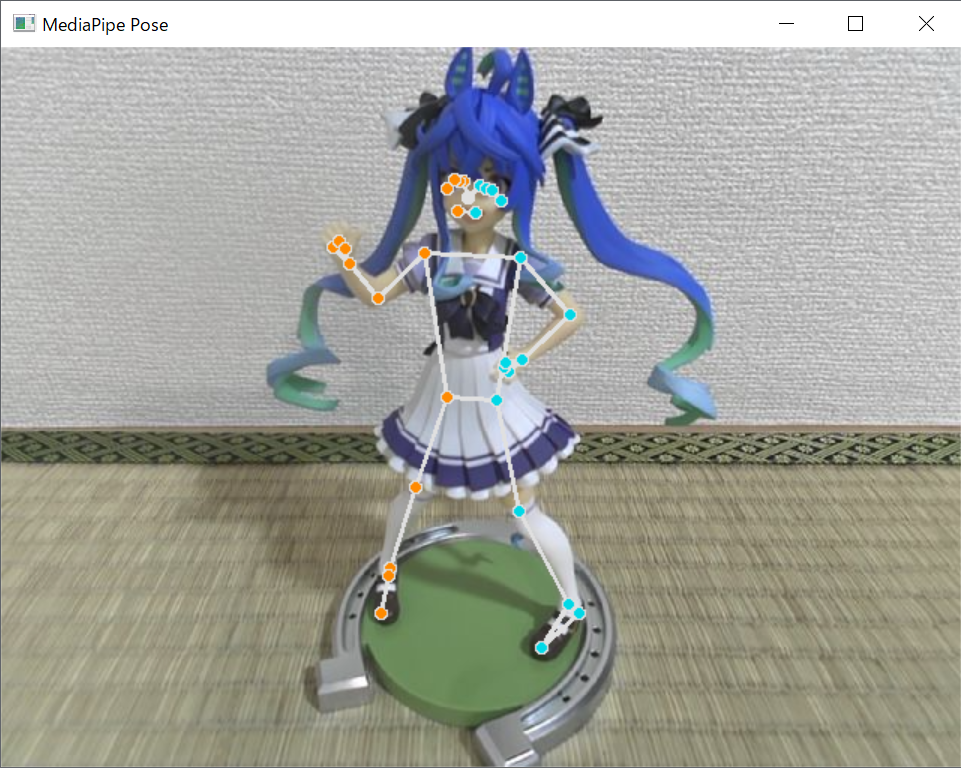

# VRChat用のフルトラをWEBカメラとMediaPipeで作ってみた

## 概要

VRChatとはVR空間上で3Dアバターを使って他の人達と交流することが出来るアプリです。


このVRChatでは様々なトラッキング機材を使用して現実世界の体の動きをVR空間上の自分の3Dアバターに反映することが出来ます。最低限の環境だとVRヘッドセットと左右のコントローラの位置関係で腕と頭の動きを再現できる **3点トラッキング** と呼ばれるものやMeta Quest3を使用しているのであればVRヘッドセットのカメラの測定によるハンドトラッキングや **Vive Trackerやmocopi** 追加のハードウェアにによる腕、胸、腰、足等の装着による **6～11点トラッキング** による所謂 **フルボディートラッキング (FBT)** により3Dアバターの動きを表現力のあるものに出来ます。

ただ、このVive Trackerやmocopiは機材として数万の投資が必要でありこれを安い費用で何とか出来ないかと考え色々と調べていたところWEBカメラを使用してカメラに写った骨格情報をVRChatに反映するというアプリやOSSをいくつか見つけました。

- [Device4VR](https://www.driver4vr.com/)
  - PC, Android, iOSに対応したカメラによるボディートラッキングツール
  - 一部機能は有料
- [Mediapipe-VR-Fullbody-Tracking](https://github.com/ju1ce/Mediapipe-VR-Fullbody-Tracking)
  - MediaPipeと呼ばれるGoogleが開発したニューラルネットワークによる姿勢推定を使用したボディートラッキングツール
  - 無料

これらを見て折角なら自分で自作してみたくなったので、この記事ではカメラによるボディートラッキングツールの開発でどのような実装が必要なのかを解説したいと思います。ただし **最低限の実装** にはなってくるので **WEBカメラを使用したVRChatでのボディーフルトラッキングのHello World** として読み進めていただければ幸いです。

### 使用する機材

#### VRヘッドセット

[Meta Quest 3](https://www.meta.com/jp/quest/quest-3/?srsltid=AfmBOorMWRR-k0CTNcDzh6NGu5OTd-ml-eu-vAGXKTBVvfCcM5oD1qWt)


言わずと知れたFacebookやInstagramの開発で有名なMeta社が販売するVRヘッドセット

#### WEBカメラ

Amazonで2000円程度で売られている格安のWEBカメラ


姿勢推定ができれば良いだけの画質があれば良いので高品質なものは不要となります。

### 使用するアバター

今回の技術検証で使用するアバターは [septem47](https://septem47.booth.pm/) さんが販売されているこちらのアバターを購入し使用させていただきました。

[【オリジナル3Dモデル】シアン - Cian #Cian3D](https://septem47.booth.pm/items/5482062) PC番 (VRM同梱)


## 使用するライブラリや仕様等

今回、WEBカメラによるフルボディートラッキングの実装にあたり次のライブラリや仕様を使用しました。

### MediaPipe

[MediaPipe ソリューション ガイド  |  Google AI Edge  |  Google AI for Developers](https://ai.google.dev/edge/mediapipe/solutions/guide?hl=ja)

**MediaPipeとはGoogleが開発しているアプリケーションに人工知能 (AI) と機械学習 (ML) 用のライブラリとツール群**になります。オブジェクト検知、画像分類、ジェスチャー認識、手、顔、姿勢等のランドマーク検出等の画像に関するものやテキスト分類、言語検出等のテキストに関するもの、音声に関するもの、画像生成やLLM推論等の生成AIに関するもの等、様々な機能を有するライブラリ、ツール群となっています。

[姿勢ランドマーク検出ガイド  |  Google AI Edge  |  Google AI for Developers](https://ai.google.dev/edge/mediapipe/solutions/vision/pose_landmarker?hl=ja)


画像参照：[姿勢ランドマーク検出ガイド  |  Google AI Edge  |  Google AI for Developers](https://ai.google.dev/edge/mediapipe/solutions/vision/pose_landmarker?hl=ja)

今回のWEBカメラによるフルボディートラッキングの実装に必要となる機能は、その中の姿勢ランドマーク検出機能が必要になるのでそちらを利用します。こちら、静止画や動画の画像からニューラルネットワークの推定により **33個所の身体のランドマーク** を割り出す事が出来る機能になります。


画像参照：[姿勢ランドマーク検出ガイド  |  Google AI Edge  |  Google AI for Developers](https://ai.google.dev/edge/mediapipe/solutions/vision/pose_landmarker?hl=ja)

### VRChatとOSC (Open Sound Control)

**OSC (Open Sound Control) とは電子楽器やコンピュータなどの機器においてそのデータをネットワーク経由でリアルタイムに送受信するためのプロトコル**です。しかしその汎用性から、しばしばサウンド関係以外のアプリケーションでも使用される事があるらしいです。

[VRChat - OSC Overview](https://docs.vrchat.com/docs/osc-overview)

VRChatでは上記のような仕様が公開されており、ここにはアバターパラメータ、デバッグ、コントローラーの入力、トラッキング、アイトラッキング等の仕様が定義されており、これに従ってMediaPipeから取得したデータを加工しOSCを用いてデータを転送することでボディーフルトラッキングが実装出来るのではないかと考えました。

[VRChat - OSC Trackers](https://docs.vrchat.com/docs/osc-trackers)

ここに定義されている仕様を読む限りでは**OSC経由でのVRChatのフルボディートラッキングは8点トラッキング**になります。VRヘッドセットとコントローラ、そして、このOSC経由のトラッキングにより最大11点トラッキングとなります。

仕様を要約すると下記のようになります。

#### OSCアドレス

```
/tracking/trackers/1/position
/tracking/trackers/1/rotation
/tracking/trackers/2/position
/tracking/trackers/2/rotation
/tracking/trackers/3/position
/tracking/trackers/3/rotation
/tracking/trackers/4/position
/tracking/trackers/4/rotation
/tracking/trackers/5/position
/tracking/trackers/5/rotation
/tracking/trackers/6/position
/tracking/trackers/6/rotation
/tracking/trackers/7/position
/tracking/trackers/7/rotation
/tracking/trackers/8/position
/tracking/trackers/8/rotation
/tracking/trackers/head/position
/tracking/trackers/head/rotation
```

これらのアドレスに対し3つのX, Y, Zの順番でfloat値を入力します。これらの値の仕様としては下記のようになります。

- 基本的にUnityの座標系になる
- +Yが上
- 1.0の数値を1mとする
- 左手座標系
- 回転はオイラー角となりオイラー角はY, X, Zの順番で適用される

positionがトラッカーのワールド座標系での位置でrotationがトラッカーのワールド座標系での回転角 (オイラー角) となり各ボーンのローカルの位置や回転角でないので注意が必要です。サポートされている部位としては腰、胸、足✕2、股✕2、肘✕2となります。

1から8のどの番号がどの部位になるのかは決まっておらずVRChatでキャリブレーションされた際にOSCにより入力された座標とVRChatのアバターのトラッカーに追従する部位が自動的に対応付けられるので、どの番号にどの部位を割り当てるかはアプリケーションの任意で大丈夫となります。

またheadの位置、回転角に関しては入力があれば、その数値を元にトラッカーの座標、回転角の数値をシフトさせてくれる仕様になっています。

### その他のライブラリ、フレームワーク

今回の実装の本質とは多少外れますが導入したライブラリ、フレームワークの一覧を列挙します。

- OpenCV
  - 画像処理用、画像解析のためのライブラリ
  - カメラへのアクセスと姿勢ランドマークをプロットした画像を表示するために使用
- Matplotlib
  - グラフ描画のためのライブラリ
  - 姿勢ランドマークの3次元的なプロットを表示するために使用
- NumPy
  - 数値計算を効率的に行うためのライブラリ
  - 姿勢ランドマークの数値をベクトル、行列を用いて変換処理を行うために使用
- SciPy
  - 数値解析を行うためのライブラリ
  - NumPyの汎用的なベクトル、行列の計算機能ではサポートされていない3次元座標の特性に特化した計算処理を行うために使用
- python-osc
  - OSCの通信を行うためのライブラリ
  - PythonからVRChatへトラッキングデータを送信するために使用
- Flask
  - 軽量なWebアプリケーションを実装するためのフレームワーク
  - アプリケーションを作る上で必要なUIを作成するのが手間だったのでWeb APIで簡易的なインタフェースを作成するために使用

## 実装

今回、WEBカメラを用いたVRChat用のボディーフルトラッキングのサンプルプログラムはこちらになります。

https://github.com/redlily/training_vrchat_tracking

開発環境

- Python 3.12
- Poetry

実行方法

```Python
$ poetry install
$ poetry run python xvr/vr_chat_client.py
```

使い方

1. このサンプルアプリを起動します。
1. WEBカメラの画角内に入り棒立ちします。  
このときカメラに向かって正対している事が望ましいです。
1. VRヘッドセットを装着しVRChatを起動します。
1. VRChat内でOSCを有効化します。
1. VRヘッドセットからリモートデスクトップからブラウザーを起動、またはヘッドセット内のブラウザーを起動してカメラキャリブレーション用のURLにアクセスしてキャリブレーションをおこないます。  
サンプルアプリとブラウザが同一マシーンで動作しているなら http://127.0.0.1:5000/calibration にアクセスし異なる場合はURLのIPアドレス部分を正しいものに書き換えてアクセスします。
1. VRChat内でもキャリブレーションを行います。  
IKポイントの位置に問題がある場合は **OSC トラッカー を中央に配置** を実行してみてください。

### WEBカメラからの画像取得と姿勢ランドマークをカメラ画像の上にプロット

https://github.com/google-ai-edge/mediapipe/blob/master/docs/solutions/pose.md

上記のサンプルプログラムから必要な部分を抜粋しました。

こちら非常に簡単なプログラムとなっており、たった、これだけのソースコードでWEBカメラから動画データの取得を行い、MediaPipeに画像データを入力、推定された姿勢ランドマークを元の動画データにプロットし、その結果をウィンドウで確認できるプログラムとなっています。

```Python
import cv2
import mediapipe as mp
import numpy as np
mp_drawing = mp.solutions.drawing_utils
mp_drawing_styles = mp.solutions.drawing_styles
mp_pose = mp.solutions.pose

# For webcam input:
cap = cv2.VideoCapture(0)
with mp_pose.Pose(
    min_detection_confidence=0.5,
    min_tracking_confidence=0.5) as pose:
  while cap.isOpened():
    success, image = cap.read()
    if not success:
      print("Ignoring empty camera frame.")
      # If loading a video, use 'break' instead of 'continue'.
      continue

    # To improve performance, optionally mark the image as not writeable to
    # pass by reference.
    image.flags.writeable = False
    image = cv2.cvtColor(image, cv2.COLOR_BGR2RGB)
    results = pose.process(image)

    # Draw the pose annotation on the image.
    image.flags.writeable = True
    image = cv2.cvtColor(image, cv2.COLOR_RGB2BGR)
    mp_drawing.draw_landmarks(
        image,
        results.pose_landmarks,
        mp_pose.POSE_CONNECTIONS,
        landmark_drawing_spec=mp_drawing_styles.get_default_pose_landmarks_style())
    # Flip the image horizontally for a selfie-view display.
    cv2.imshow('MediaPipe Pose', cv2.flip(image, 1))
    if cv2.waitKey(5) & 0xFF == 27:
      break
cap.release()
```

このプログラムでWEBカメラを用いて撮影する素材として下記のフィギュアを使用します。


このフィギュアに対しWEBカメラで撮影した画像にランドマークをプロットすると下記のような結果を得ることが出来ます。



このプログラムの中で推定された姿勢ランドマーク等の結果が収納される箇所は下記の箇所になります。

```Python
results = pose.process(image)
```

このresultsのデータ構造が下記のようになります。

```
PoseLandmarkerResult:
  Landmarks:
    Landmark #0:
      x            : 0.638852
      y            : 0.671197
      z            : 0.129959
      visibility   : 0.9999997615814209
      presence     : 0.9999984502792358
    Landmark #1:
      x            : 0.634599
      y            : 0.536441
      z            : -0.06984
      visibility   : 0.999909
      presence     : 0.999958
    ... (33 landmarks per pose)
  WorldLandmarks:
    Landmark #0:
      x            : 0.067485
      y            : 0.031084
      z            : 0.055223
      visibility   : 0.9999997615814209
      presence     : 0.9999984502792358
    Landmark #1:
      x            : 0.063209
      y            : -0.00382
      z            : 0.020920
      visibility   : 0.999976
      presence     : 0.999998
    ... (33 world landmarks per pose)
  SegmentationMasks:
    ... (pictured below)
```

取得できる姿勢ランドマークは二種類あり **正規化された座標である、Landmarks** と **ワールド座標である、WorldLanmarks** になり特性は下記のようになります。

正規化された座標 (Landmarks)

- x, y は 0.0 ～ 1.0の範囲で正規化された値、画像の幅と高さので正規化されます。つまりカメラの画像の座標と対応付けられる値になります。
- zは腰を中心として値が小さいほどカメラに近く、値が大きいほどカメラから遠ざかる値になります。スケールに関してはxとほぼ同じスケールが使用されます。

ワールド座標 (WorldLanmarks)

- x, y, z は腰を原点とした実世界の座標 (メートル単位) の値となります。

Landmarksはカメラから見たランドマークの相対的な座標になりWorldLandmarkも腰を中心としたランドマークの相対的な座標になります。これらの特性を理解したうえでこれらの座標データをVRChat用のデータとして加工した上で転送する処理を実装する必要があります。

### 姿勢ランドマークをMatplotlibで3Dでプロット

MediaPipeで取得したランドマークをVRChat用の座標に変換する前に3D空間にボーンをテロップしたほうが震度情報 (z値) の確認もしやすく、VRChat用の座標変換のイメージも湧きやすくなると思います。

使用するライブラリとしてはMatplotlibというグラフ描画用のライブラリを使用し描画を行います。

```Python
# 腰を原点としたワールド座情系のポーズ座標
pose_world_points = [np.array([0, 0, 0], dtype=np.float32) for i in range(33)]


def update_pose(pose_landmarks, pose_world_landmarks):
    """
    ポーズの更新を行う
    """
    if pose_landmarks is not None:
        for i in range(33):
            landmark = pose_landmarks.landmark[i]
            world_landmark = pose_world_landmarks.landmark[i]
            if landmark.visibility:
                pose_points[i] = np.array([landmark.x, landmark.y, landmark.z], dtype=np.float32)
                pose_world_points[i] = np.array([world_landmark.x, world_landmark.y, world_landmark.z], dtype=np.float32)


def run_analyze_pose():
    """
    ポーズの解析を行う
    """
    mp_pose = mp.solutions.pose
    cap = cv2.VideoCapture(0)
    with mp_pose.Pose(
            min_detection_confidence=0.5,
            min_tracking_confidence=0.5) as pose:
        while cap.isOpened():
            success, image = cap.read()
            if not success:
                print("Ignoring empty camera frame.")
                # If loading a video, use 'break' instead of 'continue'.
                continue

            image.flags.writeable = False
            image = cv2.cvtColor(image, cv2.COLOR_BGR2RGB)
            results = pose.process(image)

            if results.pose_landmarks and results.pose_world_landmarks:
                update_pose(results.pose_landmarks, results.pose_world_landmarks)

        cap.release()

landmark_groups = [
    [8, 6, 5, 4, 0, 1, 2, 3, 7],  # 目
    [10, 9],  # 口
    [11, 13, 15, 17, 19, 15, 21],  # 右手
    [11, 23, 25, 27, 29, 31, 27],  # 右半身
    [12, 14, 16, 18, 20, 16, 22],  # 左手
    [12, 24, 26, 28, 30, 32, 28],  # 左半身
    [11, 12],  # 型
    [23, 24],  # 腰
]

fig = plt.figure()
ax = fig.add_subplot(111, projection="3d")


def update_plot():
    """
    プロットの更新を行う
    """
    while True:
        ax.cla()

        if calibration_enabled:
            ax.set_xlim3d(-1, 1)
            ax.set_ylim3d(-1, 1)
            ax.set_zlim3d(0, 2)
        else:
            ax.set_xlim3d(-1, 1)
            ax.set_ylim3d(-1, 1)
            ax.set_zlim3d(1, -1)

        for group in landmark_groups:
            x = [pose_points[i][0] for i in group]
            y = [pose_points[i][1] for i in group]
            z = [pose_points[i][2] for i in group]

            ax.plot(x, z, y)

        plt.pause(0.05)


if __name__ == '__main__':
    threading.Thread(target=run_analyze_pose).start()
    update_plot()
```

これを実行した結果が下記のようになります。


こちらのプログラムですが描画はメインスレッド、WEBカメラでの撮影と姿勢の推定は別のスレッドで処理していてランドマークの位置の変数を排他制御なしにアクセスしていますが厳密な描画を求めていないので、その実装は省略しています。

### 姿勢ランドマークをVRChatに送信する

#### 座標変換

MediaPipeから出力される座標データをそのままVRChatに送信してもそのデータは上手くVRChatに反映されません。MediaPipeの座標データをそのまま送信した場合、VRChat内でキャリブレーションを行おうとした場合にIK用のポイントが下の画像のように全く意図しない場所に表示されます。


それらの要因としては2つあります。

まず1つ目は **MediaPipeのWorldLandmarkの座標系は+Yが上方向、+Zが手前方向、+Xが右方向の右手座標系** となり対して **VRChatの標系はUnityと同様の+Yが上方向、+Zが手前方向、+Xが左方向の左手座標系** になるのでX軸の符号を入れ替える変換が必要になります。

そして2つ目はカメラが撮影対象を見上げたり見下ろしたりするように配置したり、カメラを90度、傾けたりもしくは上下逆さまなような配置を行った場合にはWorldLandmarkで出力されてくる姿勢ランドマークの座標も、そのカメラの傾きそれに従って回転するのでこれを補正する必要があります。


それらの座標を補正する下記のような実装を行います。

```Python
# 腰を原点としたワールド座情系のポーズ座標
pose_world_points = [np.array([0, 0, 0], dtype=np.float32) for i in range(33)]

# 補正されたVRC用の座標系のポーズ座標
pose_virtual_points = [np.array([0, 0, 0], dtype=np.float32) for i in range(33)]


def update_pose(pose_landmarks, pose_world_landmarks, image_size):
    """
    ポーズの更新を行う
    """
    if pose_landmarks is not None:
        for i in range(33):
            landmark = pose_landmarks.landmark[i]
            world_landmark = pose_world_landmarks.landmark[i]
            if landmark.visibility:
                pose_points[i] = np.array(
                    [landmark.x - 0.5, (landmark.y - 0.5) * (image_size[1] / image_size[0]), landmark.z],
                    dtype=np.float32)
                pose_world_points[i] = np.array([world_landmark.x, world_landmark.y, world_landmark.z],
                                                dtype=np.float32)

    global pose_virtual_points
    if calibration_enabled:
        pose_virtual_points = [calibration_matrix @ np.append(pose_world_points[i], 1.0) for i in range(33)]
        modify_virtual_pose()
    else:
        pose_virtual_points = pose_world_points


# 座標補正の行列
calibration_matrix = np.eye(4, dtype=np.float32)

def update_calibration_parameter():
    global calibration_enabled
    calibration_enabled = True

    top_point = (pose_world_points[7] + pose_world_points[8]) / 2
    bottom_point = (pose_world_points[29] + pose_world_points[30]) / 2

    # Y軸傾きの補正値算出
    y_axis = np.array([0, 1, 0], dtype=np.float32)
    y_slop = (top_point - bottom_point) / np.linalg.norm(top_point - bottom_point)
    y_slop_cos = y_axis @ y_slop
    y_slop_axis = np.cross(y_slop, y_axis)
    y_slop_sin = np.linalg.norm(y_slop_axis)
    y_slop_axis /= y_slop_sin
    ys_x, ys_y, ys_z = y_slop_axis
    ys_c = y_slop_cos
    ys_s = y_slop_sin
    ys_t = 1.0 - ys_c
    y_slop_mat = np.eye(4, dtype=np.float32)
    y_slop_mat[:3, :3] = np.array([
        [ys_t * ys_x * ys_x + ys_c, ys_t * ys_x * ys_y - ys_s * ys_z, ys_t * ys_x * ys_z + ys_s * ys_y],
        [ys_t * ys_x * ys_y + ys_s * ys_z, ys_t * ys_y * ys_y + ys_c, ys_t * ys_y * ys_z - ys_s * ys_x],
        [ys_t * ys_x * ys_z - ys_s * ys_y, ys_t * ys_y * ys_z + ys_s * ys_x, ys_t * ys_z * ys_z + ys_c]
    ], dtype=np.float32)

    # 座標系変換
    modify_coordination_system_mat = np.eye(4, dtype=np.float32)
    modify_coordination_system_mat[0, 0] = -1

    global calibration_matrix
    calibration_matrix = modify_coordination_system_mat @ y_slop_mat
```

実装内容としてはカメラを設置し撮影対象者に基準となる場所に棒立ちしてもらい、その段階でupdate_calibration_parameterメソッドの呼び出しを行い撮影対象者を基準としてカメラの傾きを補正するような処理内容となります。そしてupdate_poseメソッド内でMediaPipeから受け取った座標に対し座標補正をかける処理となります。


このときupdate_calibration_parameterメソッドをVRヘッドセットを被ったままでもVRヘッドセットのWebブラウザーやリモートデスクトップのブラウザを用いて呼び出しやすいようにするためFlaskを使用して、このメソッドを呼び出すWeb APIを用意しWebブラウザーを通じて呼び出し出来るようにしておきます。

```Python
web_app = Flask(__name__)


@web_app.route("/calibration")
def web_calibration():
    update_calibration_parameter()
    return "Success"

def run_flask():
    web_app.run(debug=True, use_reloader=False)


if __name__ == '__main__':
    threading.Thread(target=run_flask).start()
```

このプログラムとWebブラウザーが同一マシーン上で動作している場合は `http://127.0.0.1:5000/calibration` 、異なる場合でも適切なIPアドレスで上記のWeb APIにアクセスすることによりupdate_calibration_parameterメソッドを実行出来るようになります。


#### 回転パラメータの必要性

このVRChat用のOSCパラメータですが座標 (位置) パラメータだけでもトラッキングデータとしてアバターを動かすことが出来ます。

それならなぜ回転パラメータが必要なのか？このパラメータを欠落させると何が起こるのか？それは回転パラメータがない状態だとトラッキングと紐付いているアバターの各パーツが上面の方向に固定されてしまうので現実世界で肩の向き、腰の向き、足の向き、腕の向きを変えても回転パラメータが欠落しているので大変不自然な動きとなってしまいます。


しかしMediaPipeには体の各パーツの向きや回転等の情報は全く含まれていません。そこで、それらのパラメータはMediaPipeが算出したランドマークの情報から算出する必要があります。

実装方法の例としては関節の曲がり具合から外積、内積、正規化を駆使して各パーツのローカルなX軸, Y軸, Z軸の直行するベクトルを算出、それ各パーツのローカルな回転行列として、そこからZ, X, Yのオーダーのオイラー角に変換するといった処理になります。


細かい実装は長くなるのでサンプルを参照してください。

また、細かい回転パラメータのズレはVRChatのキャリブレーションの際にオフセットされるようです。

#### OSCによるVRChatへのデータ送信処理

OSCによるVRChatへの姿勢データの送信の実装は `python-osc` を用いて実装を行います。

送信先のIPアドレスはSteam版やQuest Link版のVRChatを使用している場合は **127.0.0.1** の **9000番** ポートに向けて送信し、Quest単体版のVRChatを使用している場合はQuestが接続しているWi-FiのIPアドレスを調べ、そのアドレスの9000番ポートに送信を行います。

```Python
# VRChatに転送するトランスフォーム情報
pose_virtual_transforms = {
    "head": {
        "path": "head",
        "enable": True,
        "position": np.array([0, 0, 0], dtype=np.float32), # 位置
        "rotation": np.eye(3, dtype=np.float32), # 回転行列
    },
    "chest": {
      ...略
    }
    "hip": {
      ...略
    }
    ...略
}

# VRChat用のOSCクライアント
vrchat_client = udp_client.SimpleUDPClient("127.0.0.1", 9000)


def send_pose_to_vrchat():
    """
    VRChatにポーズを送信する
    """
    for key in pose_virtual_transforms:
        value = pose_virtual_transforms[key]
        if value["enable"]:
            position = value["position"]
            
            rotation_mat = value["rotation"]
            rotation_rot = Rotation.from_matrix(rotation_mat)
            rotation_zxy = rotation_rot.as_euler("zxy", degrees=True)
            
            vrchat_client.send_message(
                f"/tracking/trackers/{value["path"]}/position",
                position.tolist())
            vrchat_client.send_message(
                f"/tracking/trackers/{value["path"]}/rotation",
                [rotation_zxy[1], rotation_zxy[2], rotation_zxy[0]])
```

## あとがき

WEBカメラとMediaPipeを使用したある程度、VRChat上で動作する実装解説はいかがだったでしょうか？

この記事の筆者である私ですが1ヶ月ほど前に友人宅で初めてMeta Quest3でVRChatを触らせていただき、その自由さと没入感に感銘を受けて自分でもQuest3を購入しVRChatに没頭していきました。

しかし、このアプリに慣れてくるとVRヘッドセットとコントローラの3点トラッキングでは思ったほど体を自由に動かせず、より自由に体を動かしてみたいと欲が出てき始めトラッキングツールを探し始めたのですが有名どころのトラッカーも中々良いお値段し躊躇ってしまったわけです。

そこで代替出来る安価なトラッキングツールを探していたところ精度は悪いもののMediaPipeとWEBカメラでVRChat用のボディーフルトラッキングを見つけました。これを見て「これなら私でも作れるのでは？」と思い立って作ったのが始まりです。

技術調査も兼ねて最低限ではあるものの、ある程度、 (WEBカメラのトラッキングにしては) 精度良く動作するサンプルプログラムが出来上がった段階で、そのノウハウを記事化したくもなったので、その記録をこの記事として残します。

今後は、このノウハウを礎に誰もが使えるようにPCアプリ化し配布したり、Android, iOSアプリへの移植し配布したり、アルゴリズムの改修による精度やパフォーマンスの向上を行っていき、私のようなVRChatのフルトラ難民を救っていきたいなと思う所存ですｗ

## 参考

- [MediaPipe ソリューション ガイド  |  Google AI Edge  |  Google AI for Developers](https://ai.google.dev/edge/mediapipe/solutions/guide?hl=ja)
- [VRChat - OSC Overview](https://docs.vrchat.com/docs/osc-overview)
